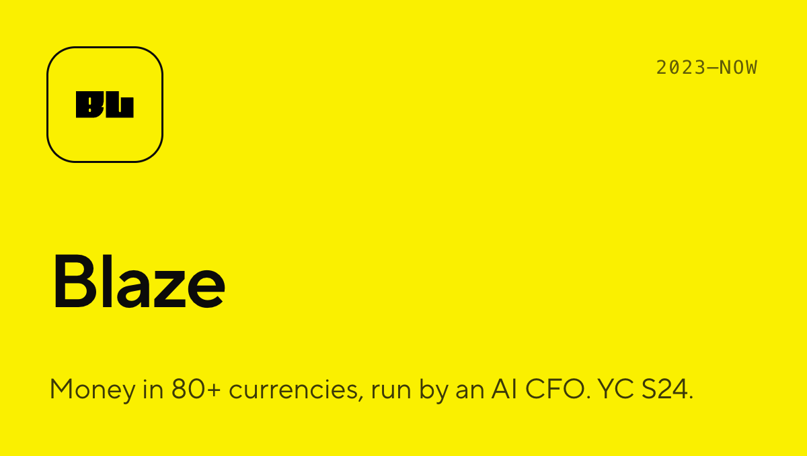
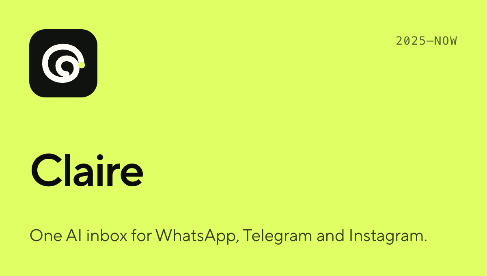
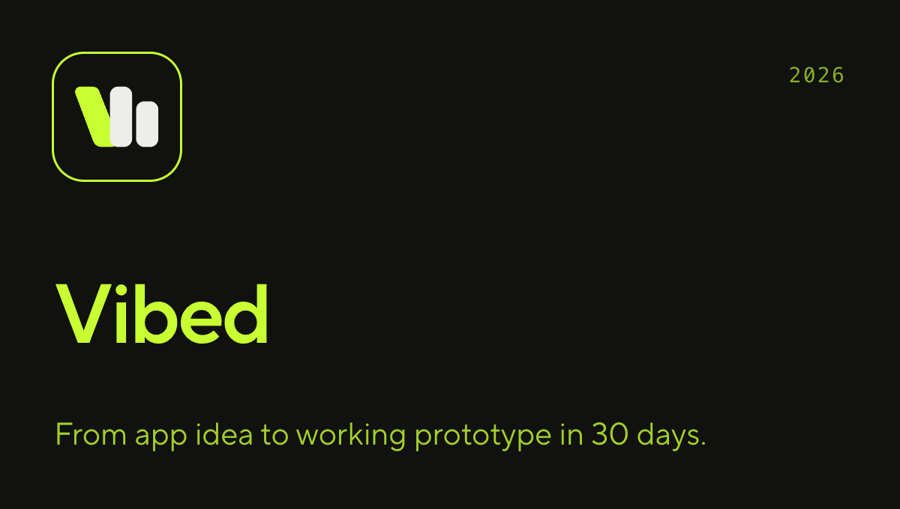
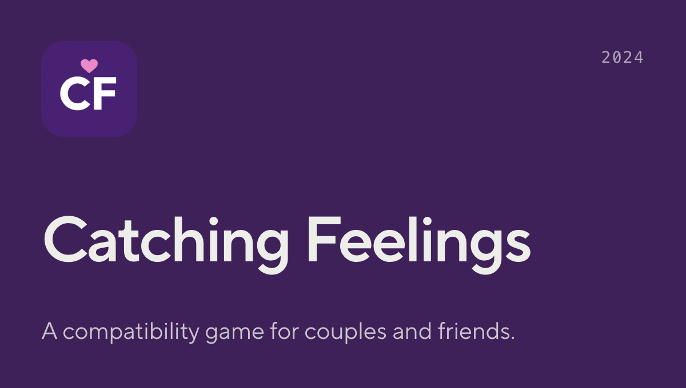

<picture>
  <source media="(prefers-color-scheme: dark)" srcset="assets/banner-dark.png">
  <source media="(prefers-color-scheme: light)" srcset="assets/banner-light.png">
  
</picture>

I've been building consumer products for 12+ years. Three startups, one Y Combinator batch, a few years leading engineering at Artsy, and shipping to 100M+ listeners at Spotify.

Right now I'm the co-founder and CTO of Blaze, and building Claire on the side. Most of my work lives in private repos, so the work below is the better picture.

### Selected work

<table>
  <tr>
    <td></td>
    <td></td>
  </tr>
  <tr>
    <td></td>
    <td></td>
  </tr>
</table>

### Open source

- [**claire**](https://github.com/l2succes/claire): an AI inbox that keeps track of what you promised.
- [**claude-switcher**](https://github.com/l2succes/claude-switcher): macOS menu bar app to switch Claude Desktop between accounts and see each one's usage limits.
- [**prowl**](https://github.com/l2succes/prowl): a dashboard for running parallel AI workstreams.
- [**x402-llm-gateway**](https://github.com/l2succes/x402-llm-gateway): an OpenRouter-compatible LLM gateway paid for with x402 micropayments.

### Before

Artsy (tech lead), Seasons (co-founder and CTO, raised $4.3M), Often (co-founder and CTO, 500K downloads and #1 in the App Store for 72 hours), Spotify, YieldMo.

### Say hi

[lucsucces.com](https://lucsucces.com) · [LinkedIn](https://linkedin.com/in/lucsucces) · [luc@lucsucces.com](mailto:luc@lucsucces.com)
